# Day 1: How Programs Run — the Machine Model, Node, and Your First Code

[← Course overview](../README.md) · [README](../README.md) · [Setup](../VS_CODE_SETUP.md) · [Day index](../DAY_INDEX.md) · [Next lesson →](../02_day_variables/02_day_variables.md)


## Start here

Read the [course README](../README.md), complete the [VS Code setup](../VS_CODE_SETUP.md), and use the [day index](../DAY_INDEX.md) to confirm where this lesson fits. Run the paired local starters before attempting [exercises](practice/exercises.md), then use [hints](practice/hints.md) and [solutions](practice/solutions.md) only after an honest attempt.

## Table of Contents

- [Start here](#start-here)

- [Why this lesson exists](#why-this-lesson-exists)
- [Prerequisites](#prerequisites)
- [What you'll be able to explain and do](#what-youll-be-able-to-explain-and-do)
- [The problem this solves](#the-problem-this-solves)
- [Keywords and terms](#keywords-and-terms)
- [Topics](#topics)
- [JS runtime deep dive](#js-runtime-deep-dive)
  - [Code is text, and a runtime turns it into behavior](#code-is-text-and-a-runtime-turns-it-into-behavior)
  - [The two runtimes you will use](#the-two-runtimes-you-will-use)
  - [Install Node.js](#install-nodejs)
  - [Get the course onto your machine](#get-the-course-onto-your-machine)
  - [Your first program](#your-first-program)
  - [The browser console is the same runtime in your pocket](#the-browser-console-is-the-same-runtime-in-your-pocket)
  - [console.log — the program speaks](#consolelog-the-program-speaks)
  - [Comments are for humans](#comments-are-for-humans)
  - [Arithmetic is the same anywhere](#arithmetic-is-the-same-anywhere)
  - [Set up your code editor](#set-up-your-code-editor)
  - [Adding JavaScript to a web page](#adding-javascript-to-a-web-page)
  - [Errors are information](#errors-are-information)
  - [Common mistakes table](#common-mistakes-table)
- [The TypeScript layer](#the-typescript-layer)
  - [What TypeScript adds](#what-typescript-adds)
  - [What TypeScript cannot catch](#what-typescript-cannot-catch)
  - [Inference versus explicit types](#inference-versus-explicit-types)
  - [One compiler error, walked through](#one-compiler-error-walked-through)
- [One-sentence mental model](#one-sentence-mental-model)
- [Learn more on MDN](#learn-more-on-mdn)
  - [TypeScript docs](#typescript-docs)
- [Read the first example line by line](#read-the-first-example-line-by-line)
- [Prediction experiment](#prediction-experiment)
- [Broken example and repair](#broken-example-and-repair)
- [Guided practice before independent work](#guided-practice-before-independent-work)
- [Practice](#practice)
  - [Level 1 — Mechanical (10-15 min)](#level-1-mechanical-10-15-min)
  - [Level 2 — Applied mini-projects](#level-2-applied-mini-projects)
  - [Level 3 — Creative synthesis](#level-3-creative-synthesis)
- [Finish line](#finish-line)
- [Prove it](#prove-it)

## Why this lesson exists

The number one reason beginners quit is not that the syntax is hard. It is that they type a few characters, something appears on a screen, and they have **no model of the machinery between the two**. `console.log` becomes a magic incantation instead of an act they understand.

This course never does magic. Day 1 builds the one mental model everything else hangs off: **code is text, and a runtime turns that text into behavior.** Every later lesson — variables, functions, the event loop, promises — is just a refinement of that sentence. If today's model is solid, nothing later feels like magic.

This day is also the reproducibility guarantee. Every command you run today must work the same way on your machine, on a colleague's machine, and on a fresh clone a year from now. The course's quality bar is that every command is verified against a clean setup, and Day 1 is where you learn those commands.

## Prerequisites

- A computer (Windows, macOS, or Linux).
- Motivation. Nothing else.
- Internet, once, to download Node.js and the editor.

There are no programming prerequisites. If you have never written a line of code, you are exactly who this course is for.

## What you'll be able to explain and do

By the end of this lesson you will be able to **do**:

- install Node.js and verify it from a terminal;
- clone (or download) this course, install its dependencies, and verify the environment;
- write a JavaScript file and run it with Node;
- open the browser console and run the same code there;
- add JavaScript to a web page inline, internally, and externally;
- set up VS Code and run commands from its integrated terminal;
- run this course's Day 1 JavaScript and TypeScript starters; and
- explain, out loud, what each of those commands actually did.

And you will be able to **explain**:

- what a runtime is;
- why JavaScript runs directly but TypeScript does not;
- what TypeScript adds to a program, and what it cannot catch;
- the difference between writing code and running code.

## The problem this solves

Sit in front of an empty editor. Your cursor blinks on a blank line. Nothing you type does anything until you "run" the file. Where does the text go? What turns characters into behavior? Why is there a whole installation step before you can write your first program?

That confusion is the problem this day solves. By the end you will be able to answer: *"I wrote text, and this specific tool read it and produced this output, and here is the path the text traveled."* That sentence is the difference between a beginner copying commands and a developer who understands what they are building on.

## Keywords and terms

| Keyword or term | Plain-English meaning |
| --- | --- |
| **runtime** | The program that reads JavaScript and produces behavior. |
| **Node.js** | A JavaScript runtime that runs outside the browser. |
| **console.log** | A function that writes a value to the console. |
| **TypeScript** | A language layer that checks JavaScript before runtime. |

## Topics

Read the topics in order: first understand the idea, then study the syntax, then compare a normal case with a boundary case, and finally complete the practice.

The existing deep-dive sections are the main topic sequence for this lesson:

- [Code is text, and a runtime turns it into behavior](#code-is-text-and-a-runtime-turns-it-into-behavior)
- [The two runtimes you will use](#the-two-runtimes-you-will-use)
- [Install Node.js](#install-nodejs)
- [Get the course onto your machine](#get-the-course-onto-your-machine)
- [Your first program](#your-first-program)

## JS runtime deep dive

### Code is text, and a runtime turns it into behavior

A program is a file of text with rules about what the text means. On its own, a `.js` file is inert — it is just characters on disk. Something has to read that text, understand it, and act on it. That something is a **runtime**.

```
you write text
     │
     ▼
runtime reads the file
     │
     ▼
runtime follows the instructions
     │
     ▼
behavior happens (output, changes, errors)
```

Two things are always true:

1. The runtime is a real program installed on the machine.
2. If no runtime is installed, your `.js` file does nothing.

When you "run a program," you are really saying: *"Runtime, please read this file and follow its instructions."* Nothing else is happening. No magic, no "the computer just knows." A runtime is a piece of software you installed, and you are going to install one next.

### The two runtimes you will use

Two runtimes matter in this course:

**The browser.** Chrome, Edge, and Firefox each contain a JavaScript engine. When a web page loads a script, the browser is the runtime that runs it. The browser gives JavaScript extra tools we do not have elsewhere — access to the page, the DOM, and web storage. Those tools are the subject of the browser phase of this course.

**Node.js.** Node is JavaScript running *outside* the browser, on your machine, without a page. Same language, same rules, different surroundings. Node cannot show a webpage, but it can read files, talk to networks, and run servers. Modern full-stack development runs JavaScript in both places.

You will use both. Today, you will use Node for files and the browser console for quick experiments. The mental model is identical in both: runtime reads text, runtime follows instructions.

### Install Node.js

Download the LTS (Long Term Support) version from [nodejs.org](https://nodejs.org/). Choose LTS — it is the stable line most teams use. This course supports **Node 20.19 or newer, or Node 22 or newer** (the current LTS lines). Pick the newest LTS installer. If your installed version is outside those lines, the environment check that runs during `npm install` will name the exact version to install.

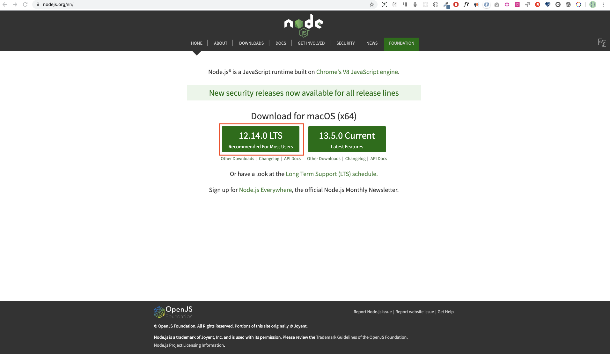

Run the installer and follow the defaults.

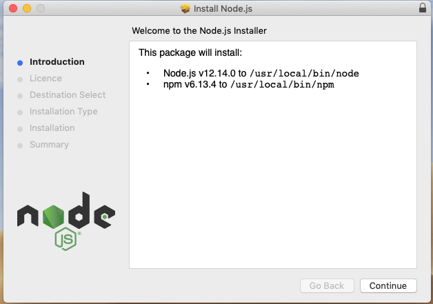

When the installer finishes, open a terminal and verify:

```powershell
node -v
```

You should see a version number, for example `v22.14.0`. If the command prints a version, Node is installed and on your `PATH`. That version output is your proof that the runtime exists and the machine can find it.

Node actually delivers two tools:

- `node` — the runtime that runs JavaScript files.
- `npm` — the package manager that installs libraries, including TypeScript.

Check both, once:

```powershell
node -v
npm -v
```

If either prints an error, the install did not complete or the terminal was opened before the install finished. Close and reopen the terminal, then try again. That is a common first trip-up, and the fix is always "reopen the terminal."

### Get the course onto your machine

You have two runtimes installed (`node` and `npm`). Now get this course's code onto your machine. The normal way uses **Git**.

- **Git** — the tool that downloads and updates code repositories. Install it from [git-scm.com](https://git-scm.com/) (on Windows choose "Git for Windows" and keep the defaults). Verify with `git --version`.
- **No Git yet?** You can still start today: on the course's GitHub page, click **Code > Download ZIP** and unzip it. You will want Git soon — the portfolio track uses it — but nothing today breaks without it.

Open a terminal and clone the repository into a folder you control:

```powershell
git clone <repository-url>
cd zero-to-hero-javascript-typescript
```

Replace `<repository-url>` with the repository address you were given. If you downloaded the ZIP instead, `cd` into the unzipped folder.

Now install the course's dependencies — the one command that makes everything else work:

```powershell
npm.cmd install
```

That command does two things:

1. It reads `package-lock.json` and installs the exact dependency tree the course was built against — TypeScript, tsx, and Vite included — into a `node_modules` folder. Nothing is installed globally. Every fresh clone gets the same tree.
2. When the install finishes, it automatically runs the course's **environment check**, which verifies your Node version and that the course's key files are present.

Then verify the whole loop with the three commands you will use every day:

```powershell
npm.cmd run day1:js
npm.cmd run day1
npm.cmd run check
```

- `npm.cmd run day1:js` runs today's JavaScript starter.
- `npm.cmd run day1` runs the TypeScript starter (through tsx — no global TypeScript install needed).
- `npm.cmd run check` type-checks every TypeScript starter in the course. A clean check prints nothing.

If any command prints an error, read the message — it is the starting point of the fix — and consult [TROUBLESHOOTING.md](../TROUBLESHOOTING.md) or [VS_CODE_SETUP.md](../VS_CODE_SETUP.md) for editor setup and tooling. On macOS, Linux, or Git Bash, `npm.cmd` is usually just `npm`; the `.cmd` suffix matters only on Windows PowerShell.

From here on, run every command in this course from the repository root — the folder that contains `package.json`. Keep a terminal open there.

### Your first program

Inside the course folder you just cloned, create a file named `hello.js` with one line:

```js
console.log('Hello, world!')
```

Run it:

```powershell
node hello.js
```

The terminal prints `Hello, world!`. Stop and trace what just happened, using the model:

1. `node` is the runtime.
2. `hello.js` is a file of text.
3. Node read the file, understood `console.log(...)` as an instruction, and followed it.
4. Following it meant printing text to the terminal.

That is the entire loop. Nothing was "compiled" in a separate step, nothing was sent to a server. A runtime read text and acted. Every program you write is that loop with more instructions.

### The browser console is the same runtime in your pocket

For quick experiments, you do not need to create files. Your browser has a console where you can type JavaScript and run it instantly.

Open your browser. Then open the developer tools:

- Windows/Linux: `Ctrl+Shift+J`
- Mac: `Command+Option+J`

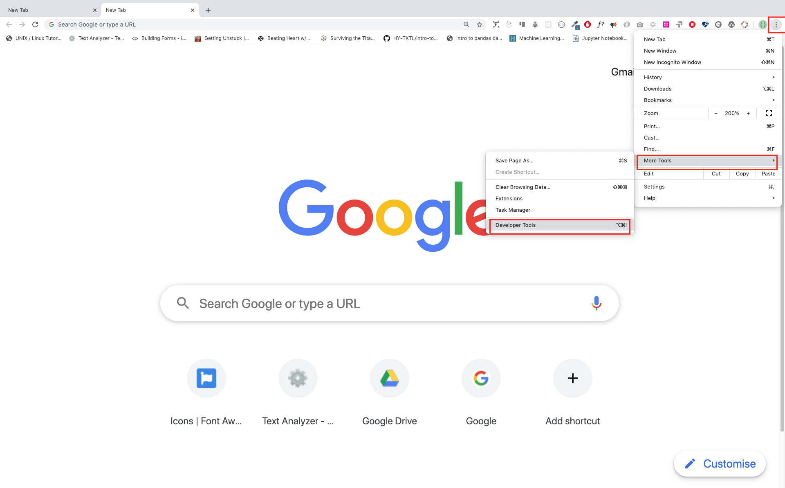

The **Console** tab is where your JavaScript goes.

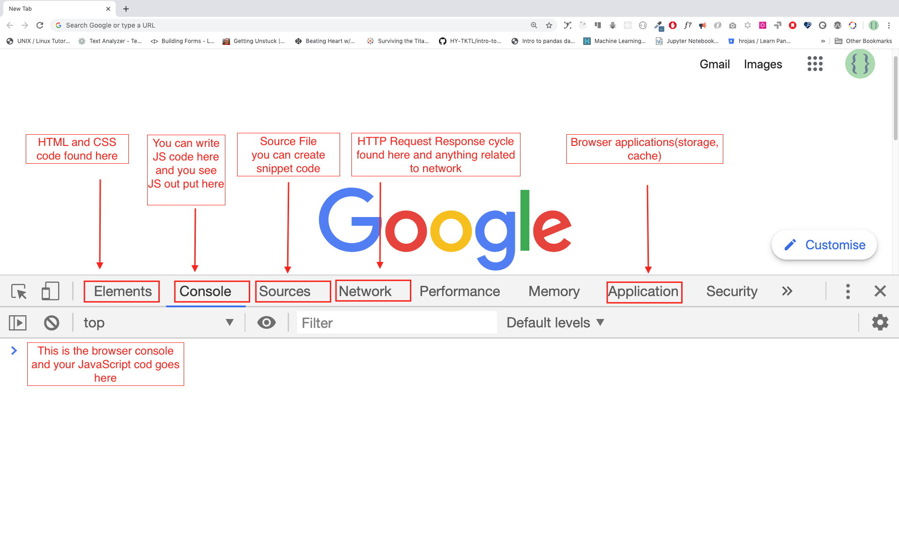

The console is the same runtime that runs web page scripts. It reads the text you type, executes it, and prints the result immediately. It is perfect for the "what happens if I write *this*?" questions that come up a hundred times a day.

```js
console.log('The console can run code too')
```

Press Enter and the console prints the string. You are running the same language, through a different front door.

### console.log — the program speaks

`console.log(...)` is how a program says something out loud. You hand it values, and it prints them.

```js
console.log('Hello, world!')
console.log('Hello', 'world', '!')
console.log('Welcome', 'to', 45, 'days', 'of', 'JavaScript')
```

Run each line. The first prints one string. The second shows that `console.log` accepts **multiple arguments** and prints them separated by spaces. The third mixes text and numbers — the runtime prints them in order.

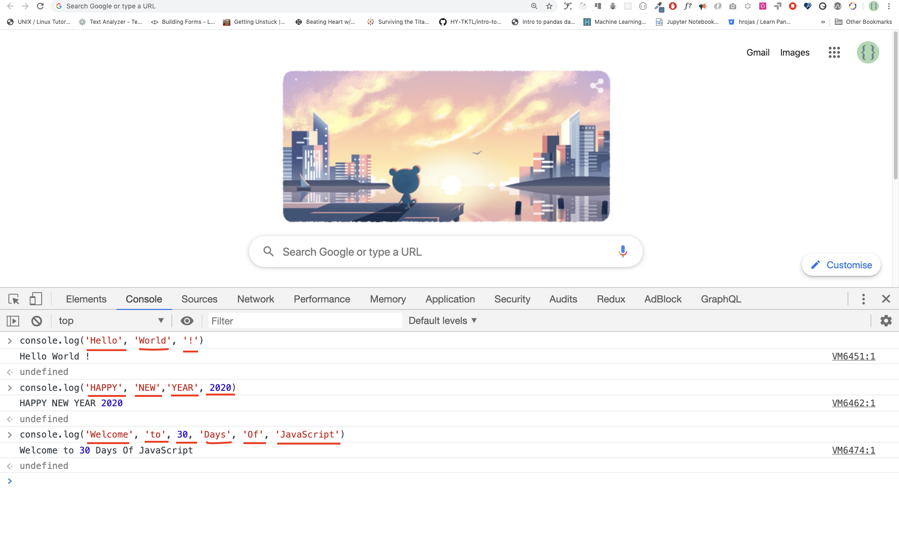

Text values must be quoted. JavaScript accepts single quotes, double quotes, and backticks, and all three are strings:

```js
console.log('single')
console.log("double")
console.log(`backtick`)
```

This course uses single quotes by default. Backticks become important later when you meet template literals.

`console` is bigger than `log` — [the console reference on MDN](https://developer.mozilla.org/en-US/docs/Web/API/console) lists `console.warn`, `console.error`, `console.table`, and the rest you will meet in later days.

### Comments are for humans

A comment is text the runtime ignores. Comments are for the human reader — for the person who comes back to this file in six months, which is often you.

```js
// a single-line comment: the runtime skips to the end of the line
console.log('this line runs')

/*
  a multi-line comment:
  everything between the slash-star and star-slash is skipped
*/
```

The runtime skips comments entirely. They cost nothing at runtime and buy readability. Use them to explain *why* a line exists, not to restate what the code obviously does.

### Arithmetic is the same anywhere

The runtime can also do math. Type these into the console or a file:

```js
console.log(2 + 3)  // 5
console.log(3 - 2)  // 1
console.log(2 * 3)  // 6
console.log(3 / 2)  // 1.5
console.log(3 % 2)  // 1  (remainder)
console.log(3 ** 2) // 9  (exponent)
```

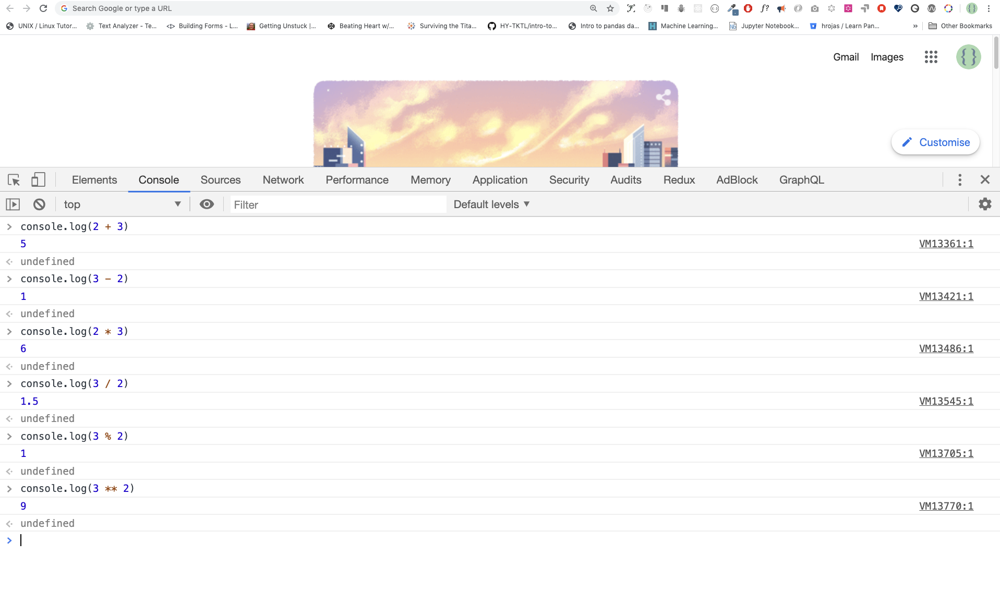

Two operators need a moment of attention:

- `%` is the **modulus** (remainder) operator. `3 % 2` is `1` because 2 goes into 3 once, leaving 1. It is used everywhere: even/odd checks, wrapping values, cycling through a list.
- `**` is **exponentiation**. `3 ** 2` is 3 squared, which is 9.

Do not read these as "equals." Read them as "evaluates to." `console.log(2 + 3)` evaluates to printing `5`.

Arithmetic is a slice of a larger family — [the expressions and operators guide on MDN](https://developer.mozilla.org/en-US/docs/Web/JavaScript/Guide/Expressions_and_operators) ranks every operator, from `+` to `===` to `&&`, in one precedence table.

### Set up your code editor

The console is great for one-line experiments. Real programs are built in files, and a code editor is where those files are written. This course uses **VS Code** (Visual Studio Code) — free, fast, and the most common editor in the industry.

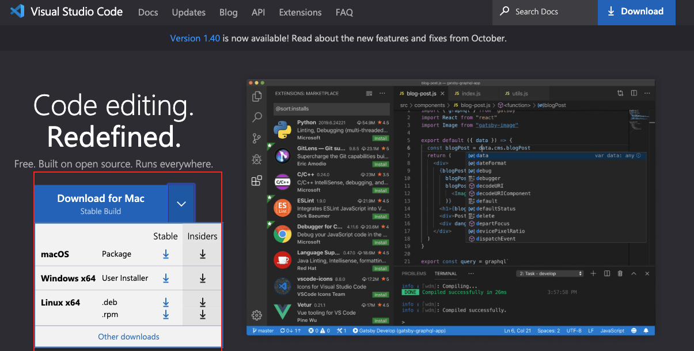

Download it from [code.visualstudio.com](https://code.visualstudio.com/) and install it with the defaults. Any editor works, but the course instructions assume VS Code.


Open VS Code, then open the course folder with **File > Open Folder** — choose the repository root you cloned (the folder containing `package.json`), not a single lesson folder. You will see the project files in the sidebar and the editor in the main area.

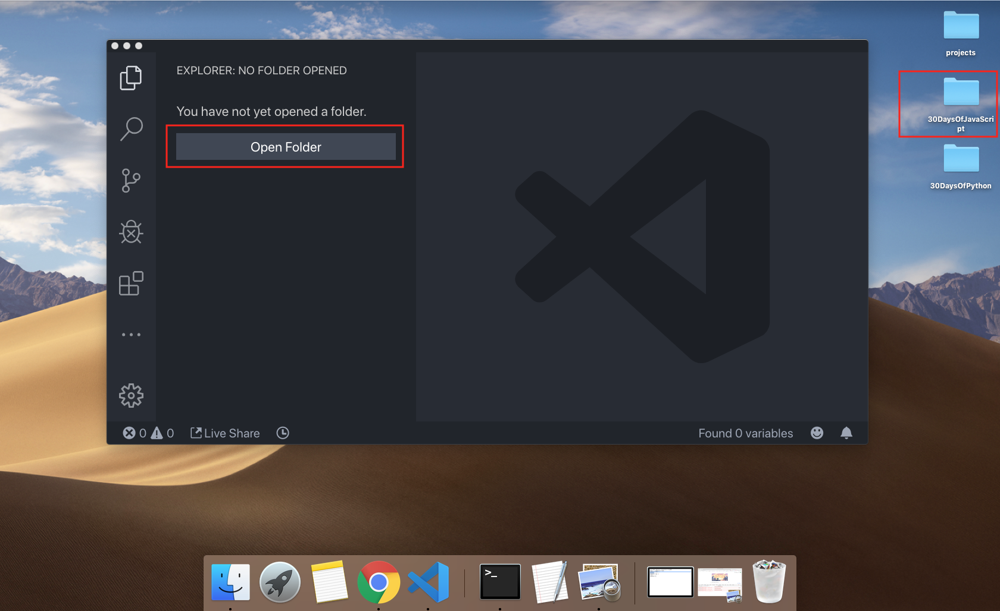

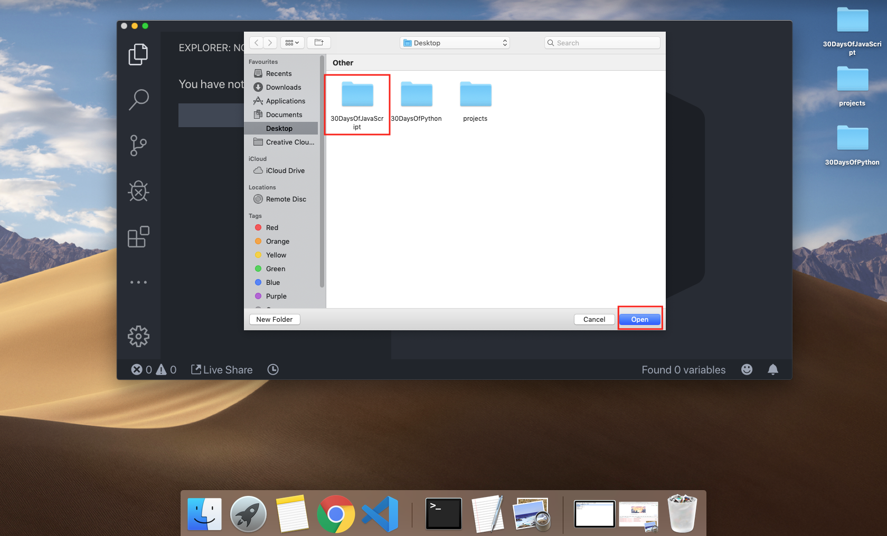

A good habit from day one: keep a terminal inside VS Code. **Terminal > New Terminal** opens one at the bottom. Run your commands there instead of switching windows.

### Adding JavaScript to a web page

The browser runs JavaScript when it reads a `<script>` tag. There are three ways to connect the two, and real projects use the third.

**Inline** — JavaScript written directly into an HTML attribute. Rare in practice; it mixes logic into markup.

```html
<!DOCTYPE html>
<html lang="en">
  <head>
    <title>Inline script</title>
  </head>
  <body>
    <button onclick="alert('Hello, world!')">Click Me</button>
  </body>
</html>
```

**Internal** — a `<script>` block inside the page, usually at the end of the body. Fine for tiny pages, but the script cannot be reused by other pages.

```html
<!DOCTYPE html>
<html lang="en">
  <head>
    <title>Internal script</title>
  </head>
  <body>
    <button onclick="alert('Hello, world!')">Click Me</button>
    <script>
      console.log('Welcome to JavaScript')
    </script>
  </body>
</html>
```

**External** — the script lives in its own `.js` file and is linked with a `src` attribute. This is the pattern real applications use: one file of behavior, reused by many pages.

```js
// introduction.js
console.log('Welcome to JavaScript')
```

```html
<!DOCTYPE html>
<html lang="en">
  <head>
    <title>External script</title>
  </head>
  <body>
    <script src="./introduction.js"></script>
  </body>
</html>
```

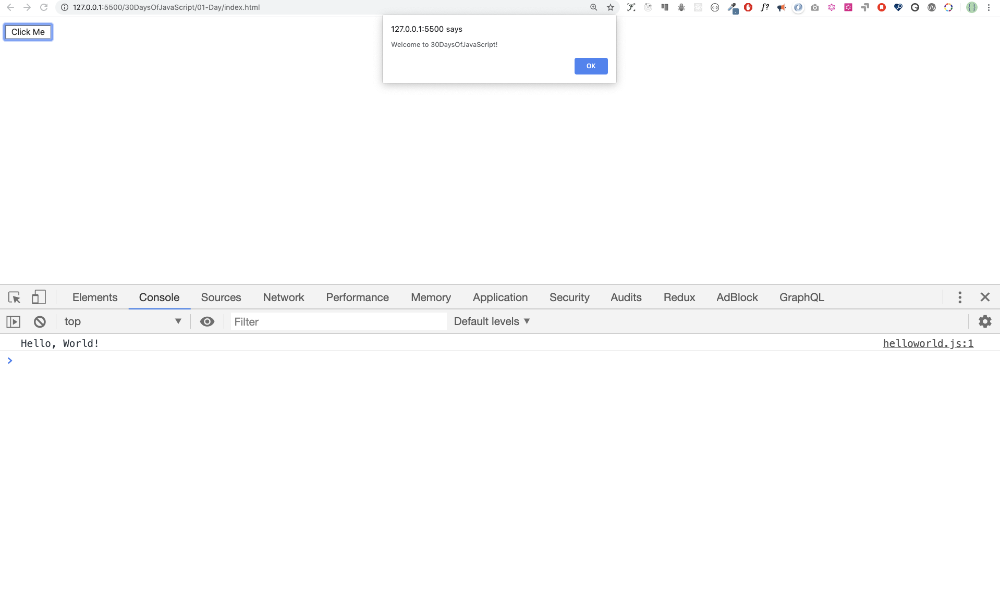

You can link several external scripts. Order matters — the browser runs them in the order the tags appear, so a script that *uses* a variable must load after the file that *declares* it.

```html
<script src="./helloworld.js"></script>
<script src="./introduction.js"></script>
```

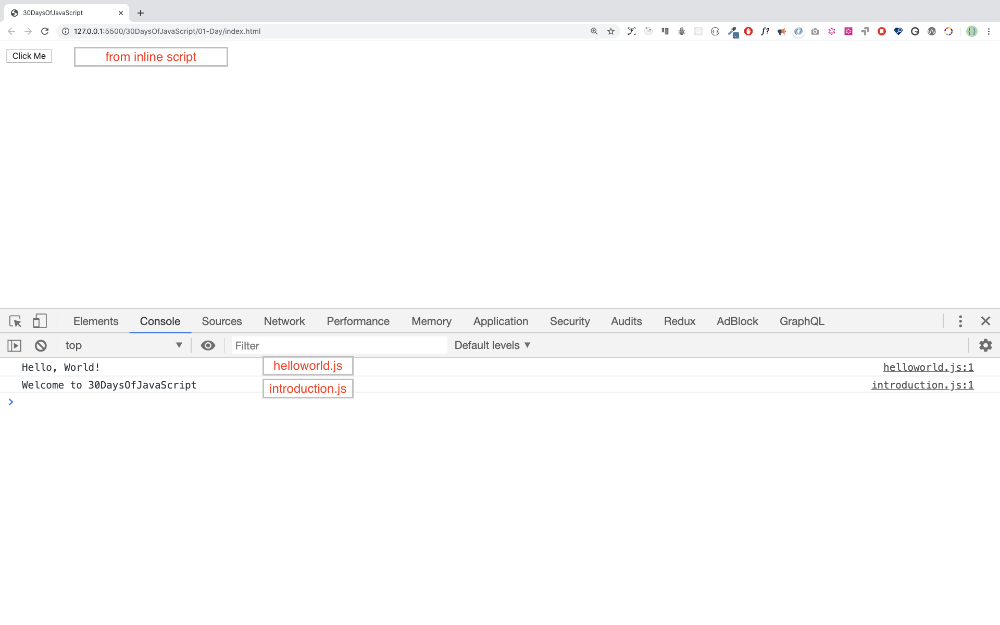

This course exercises all three ways today so you recognize them in the wild. From Day 24 onward, when we build browser apps, we use the external pattern through Vite.

### Errors are information

You will make syntax mistakes today. That is not a problem; it is how you learn to read the runtime's feedback.

Deliberately write an unclosed quote in the console:

```js
console.log('Hello, world!)
```

The console replies with a `SyntaxError` and points at the problem. It is telling you: *"I read the text, and it does not match the rules I know."* The runtime did not crash your computer; it refused to guess and told you where to look.

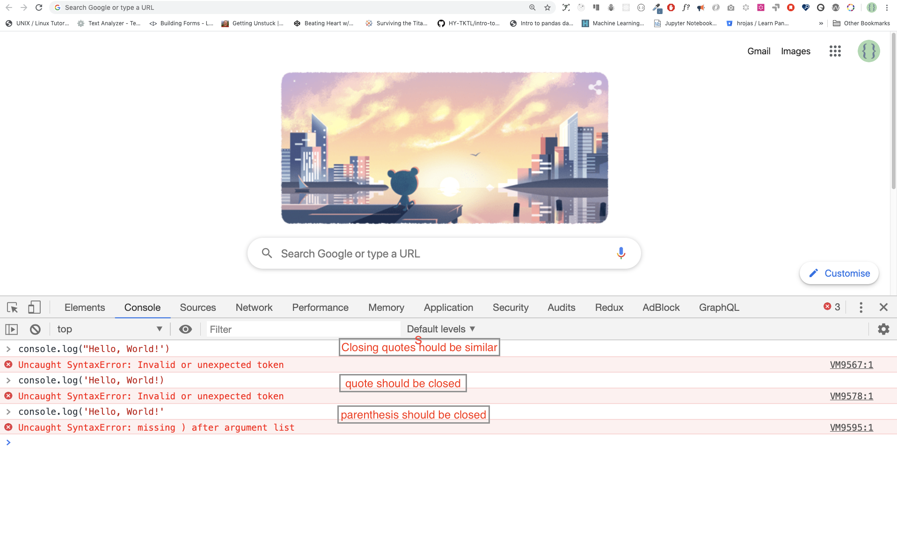

Close the quote and the same line runs. The pattern to internalize:

- the runtime reports **where** the problem is and often **what** it expected;
- the error message is the tool telling you exactly what to fix;
- finding and fixing errors is called **debugging**, and it is a core skill of the job.

Reading error messages is not a sign of failure. It is the job. Do not ignore an error message; read the first line, which names the file and line, then the message.

Every error type has a page — [the JavaScript error reference on MDN](https://developer.mozilla.org/en-US/docs/Web/JavaScript/Reference/Errors) catalogs `SyntaxError`, `ReferenceError`, `TypeError`, and dozens more, each with examples of the code that triggers it.

### Common mistakes table

| Mistake | What happens | The fix |
| --- | --- | --- |
| `node -v` says not found | Node not installed, or terminal opened before install | Reopen terminal; reinstall |
| `git` is not recognized | Git not installed, or terminal opened before install | Install Git from git-scm.com; reopen the terminal |
| `npm.cmd install` fails on the environment check | Node version outside 20.19+/22+ | Install the LTS version the error names, reopen the terminal, reinstall |
| Unclosed quote | `SyntaxError` at the string | Close the quote |
| `console.log(Hello)` (no quotes) | `ReferenceError: Hello is not defined` | Quotes make it text; unquoted names are variables |
| `console.log(2 + 3` missing paren | `SyntaxError` | Close the parentheses |
| Typing commands before install finishes | `npm` not recognized | Close and reopen the terminal |
| Confusing `%` with percent | Wrong arithmetic result | `%` is remainder, not percentage |

Each row follows the same rule: the runtime tells you something, and the error text is the starting point of the fix.

## The TypeScript layer

Now that the machine model is clear, TypeScript stops being mysterious.

JavaScript is the text the runtime runs. TypeScript is **a different text** — text that includes type annotations — which is checked, then turned into JavaScript, which is then run by the runtime.

```
you write program.ts   (JavaScript + type annotations)
          │
          ▼
TypeScript checks the types (this is the new step)
          │
          ▼
compiles to program.js
          │
          ▼
runtime runs program.js
```

The key realization: **the runtime never sees TypeScript.** TypeScript never runs. A tool reads your `.ts` file, checks it for type mistakes, produces a `.js` file, and *that* is what the runtime executes. The runtime behaves exactly as it always has — because it is the same JavaScript as before.

### What TypeScript adds

TypeScript lets you write down what type a value should be, and it verifies that before the program runs.

```ts
let age: number = 25
age = 30 // fine, 30 is a number
```

Now make the mistake:

```ts
let age: number = 25
age = 'thirty' // TypeScript refuses: 'string' is not assignable to 'number'
```

In plain JavaScript, the same mistake is silent:

```js
let age = 25
age = 'thirty' // no error. The bug waits until some later line uses age.
```

The TypeScript error appears in your editor and in `npm run check` — **before** the program runs. That is the entire value: catch type mistakes while the code is still on your screen, instead of discovering them as a confusing runtime bug later.

### What TypeScript cannot catch

TypeScript knows *types*, not *truth*. It cannot tell whether your design is right.

```ts
let age: number = 25 // TypeScript is satisfied. Is 25 the correct age? Unknown.
let total: number = price + 2 // TypeScript is satisfied. Is the formula right? Unknown.
```

And runtime reality is out of its reach: a network request failing, a file missing, a user typing nonsense. Those failures happen at runtime, and JavaScript has to handle them at runtime — which we cover in the error-handling and async phases.

TypeScript does not make bad logic good. It makes *type* mistakes early. Those are different categories, and a junior who can say which category a bug is in is already ahead of most.

### Inference versus explicit types

TypeScript often works out the type for you — this is called **inference**:

```ts
const city = 'London' // TypeScript infers: string
let score = 0 // TypeScript infers: number
```

You wrote plain JavaScript, and TypeScript already knows the types. Inference is the default and covers most code.

You write an explicit annotation when there is nothing to infer, or when it clarifies a contract:

```ts
let userName: string // declared now, assigned later
```

The course rule: annotate when it helps a reader, skip when inference is obvious. The goal is code that a team can read, not code covered in redundant types.

### One compiler error, walked through

In this course's Day 1 TypeScript starter, open `01_day_setup/starter/ts/main.ts`. Change one line so the annotation contradicts the value:

```ts
let age: number = 'thirty'
```

Now run the type check:

```powershell
npm.cmd run check
```

TypeScript reports an error on that exact line:

```
Type 'string' is not assignable to type 'number'.
```

Read it as: *"You said this variable is a number, and then you assigned a string. I cannot allow that."* Fix it by either fixing the annotation or fixing the value — whichever matches your intent:

```ts
let age: number = 30 // the annotation is right, the value was wrong
```

Now `npm.cmd run check` passes silently, which is the sound of nothing wrong. A clean check is quiet; a broken check names the line and the mismatch. Learning to hear the difference is today's proof of mastery.

## One-sentence mental model

Code is text and a runtime turns it into behavior; TypeScript is a checking layer that reads your text before the runtime does, catches type mistakes, then compiles to the very JavaScript the runtime runs.

## Learn more on MDN

Day 1 builds the machine model everything else hangs off, and MDN has the full picture. Bookmark these pages and return as you grow:

- [JavaScript](https://developer.mozilla.org/en-US/docs/Web/JavaScript) — the language overview and its history
- [JavaScript guide](https://developer.mozilla.org/en-US/docs/Web/JavaScript/Guide) — the official walk-through of the language
- [console](https://developer.mozilla.org/en-US/docs/Web/API/console) — every method beyond `log`, from `warn` to `table`
- [Expressions and operators](https://developer.mozilla.org/en-US/docs/Web/JavaScript/Guide/Expressions_and_operators) — the operator family behind today's arithmetic, ranked in one table
- [JavaScript error reference](https://developer.mozilla.org/en-US/docs/Web/JavaScript/Reference/Errors) — the exact meaning of each runtime error
- [SyntaxError](https://developer.mozilla.org/en-US/docs/Web/JavaScript/Reference/Global_Objects/SyntaxError) — the error when text does not match the language's rules
- [ReferenceError](https://developer.mozilla.org/en-US/docs/Web/JavaScript/Reference/Global_Objects/ReferenceError) — the error for names that do not exist
- [TypeError](https://developer.mozilla.org/en-US/docs/Web/JavaScript/Reference/Global_Objects/TypeError) — the error for the wrong kind of operation on a value

### TypeScript docs

- [TypeScript for the New Programmer](https://www.typescriptlang.org/docs/handbook/typescript-from-scratch.html) — why TypeScript exists and how it wraps JavaScript
- [Everyday Types](https://www.typescriptlang.org/docs/handbook/2/everyday-types.html) — the annotations you will start writing today

## Read the first example line by line

The first runnable example introduces **How Programs Run — the Machine Model, Node, and Your First Code**. Run it unchanged before editing it. Then read it line by line and write down what value exists after each declaration, which condition is tested, and what appears in the console.

| Line | Code | What the runtime is doing |
| ---: | --- | --- |
| 1 | `console.log('Hello, world!')` | Output call: the program displays the evaluated value in the console. |

The table is a starting point, not a substitute for running the example. Change one value only, predict the output, run it, and explain the difference.

## Prediction experiment

Before changing the example, write a prediction. Test one normal input, one empty or missing input, and one boundary input relevant to **How Programs Run — the Machine Model, Node, and Your First Code**. Record the input, your prediction, the observed output or error, and the rule you learned. Keep the failed prediction; it shows which mental model needs repair.

## Broken example and repair

Make one controlled mistake related to **How Programs Run — the Machine Model, Node, and Your First Code**: misspell a name, use the wrong type, omit a return, call a function too early, or change one condition. Run it and capture the useful error or incorrect output. Explain the assumption that failed, then make the smallest repair and rerun the normal and boundary cases. Do not hide the error with a broad catch or delete the failing experiment.

## Guided practice before independent work

Start with the nearest worked example. Change one value, predict the result, and run it. Next, change one rule while keeping the input the same. Finally, write a small variation from a blank file and compare it with the example. Only after these three checkpoints should you begin the numbered or level-based practice below.

## Practice

Use [practice/exercises.md](practice/exercises.md) first, then [practice/hints.md](practice/hints.md), and finally [practice/solutions.md](practice/solutions.md).

Attempt the exercises before opening [hints](practice/hints.md) or [solutions](practice/solutions.md). The solutions explain *decisions*, not just code.

### Level 1 — Mechanical (10-15 min)

1. Run `node -v` and `npm -v` in a terminal. Write down both outputs.
2. Run this course's JavaScript starter with `npm.cmd run day1:js`, and the TypeScript starter with `npm.cmd run day1`.
3. Open `01_day_setup/starter/js/main.js`. Change the sample name to your own and run it again.
4. Open `01_day_setup/starter/ts/main.ts`. Change the sample name to your own and run it again.
5. In the browser console, run `console.log('I can type here')`.
6. In the browser console, compute `2 + 3 * 4`. Write down the result and why it is that number (operator order).
7. In the browser console, deliberately write `console.log('unclosed)` and read the error message out loud.
8. Fix the unclosed quote and confirm the line runs.
9. Run a program that prints `Hello` and `World` as two separate arguments to `console.log`.
10. Predict the output of `console.log(3 % 2)`, then run it to confirm.

### Level 2 — Applied mini-projects

1. Write `hello.js` with your name inside `console.log`, and run it with `node hello.js`.
2. Write a file that prints three facts about you, one per `console.log` line, and run it with Node.
3. Write a file that declares two numbers and prints their sum, product, and quotient on separate lines.
4. In the browser console, print `Welcome` with three separate arguments and one number argument mixed in. Check the spacing.
5. Create a folder for the course, put a `.js` file in it, and run it from the terminal by path.
6. Write a file that uses a single-line comment and a multi-line comment, then a `console.log`. Run it and confirm the comments do not print.
7. Run `npm.cmd run check` on an unchanged starter and confirm it passes silently. Then break one type annotation, run check again, and read the error.
8. Find the file `01_day_setup/starter/ts/my-first-ts.ts`. Read it, run it, and add one more line of your own.
9. **MDN lookup:** Open the [console reference on MDN](https://developer.mozilla.org/en-US/docs/Web/API/console), find `console.table`, and use it to print the results of `3 ** 2`, `2 ** 10`, and `10 ** 3` in a small table. Comment on how the table output differs from `console.log`.

### Level 3 — Creative synthesis

1. Write a program that prints the result of `3 ** 2`, `2 ** 10`, and `10 ** 3` — but before running it, write down your predictions and then explain any surprise.
2. Write a program that prints a receipt: three item names, three prices, and a total that you compute with `+` inside `console.log`.
3. Write a program that prints the same sentence three times using single quotes, double quotes, and backticks, with a comment above each explaining the one difference between them.
4. In the browser console, explore the `console` object: type `console` and press Enter, then click to expand it. List three methods you see besides `log`, and write a sentence about what each seems to do.
5. Write a short paragraph in a file comment explaining, in your own words, the path a TypeScript file travels from keyboard to screen. Then run the Day 1 TypeScript starter to confirm the path still works.

## Finish line

Day 1 is complete when you can do all four of these **without notes**:

1. Run a `.js` file with Node and explain what the runtime did, in your own words.
2. Run the same idea in the browser console and say how it is the same runtime.
3. Run `npm.cmd run day1:js` and `npm.cmd run day1` from the repo root.
4. Explain to someone else why TypeScript files are checked and compiled before the runtime ever sees them.
5. Explain, out loud, what `npm.cmd install` did and what the environment check verified.

If any of the four is a guess, go back to the matching section before starting Day 2. This finish line is the course's contract with you: every day ends with things you can actually do, not just a page you read.

## Prove it

Write, in your own words, a short answer to each:

1. What is a runtime, and what does it do with your `.js` file?
2. Why does JavaScript run directly while TypeScript must be compiled first?
3. Name one thing TypeScript catches and one thing it cannot catch.
4. What does `%` do, and give a number that shows it.
5. What is the difference between a comment and executable code?
6. What does `npm.cmd install` do, and why does this course avoid installing tools globally?

Your answers are the evidence for today. If you can write them, Day 1 is banked — move to [Day 2: Variables](../02_day_variables/02_day_variables.md).

**Day 1 complete.** You can now run code in two places, you know the one mental model everything else hangs off, and you can explain exactly where TypeScript fits.
