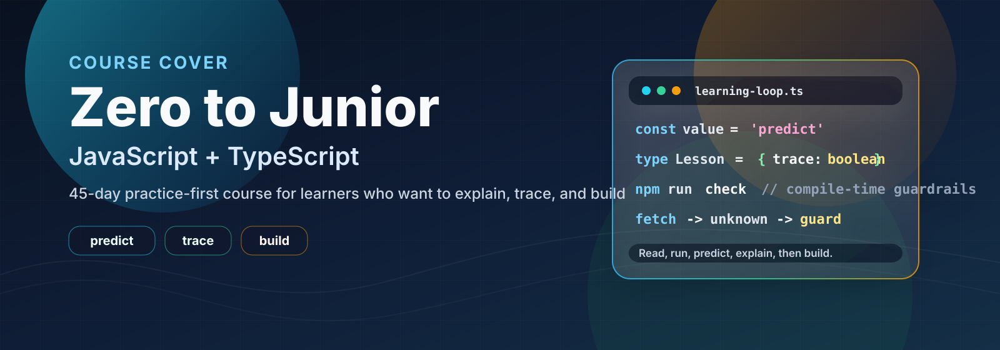

# Curriculum guide

  

This repository is a 45-day learning system, not a video playlist. Every lesson is paired: read the idea, run the JavaScript starter, compare the TypeScript starter, then solve the practice route before looking at the separate reference.

## The loop for every day

1. Read the outcomes and prerequisites. If a word is new, stop and run its smallest example.
2. Trace the starter by hand, run it with `npm.cmd run dayN:js` or open the browser page, then deliberately change one line.
3. Rebuild the exercise from a blank file. Use `practice/hints.md` only after a real attempt and `practice/solutions.md` only to review.
4. Port the result to TypeScript. Record syntax differences, what TypeScript catches, and what still needs runtime validation.
5. Explain the result aloud and write one trade-off or edge case in your notes.

## Six phases

| Days | Focus | Evidence |
| --- | --- | --- |
| 1-5 | Setup, values, operators, decisions | Explain execution, hoisting, coercion, and truthiness |
| 6-10 | Loops, functions, objects, arrays | Solve small problems without copying |
| 11-20 | Destructuring, higher-order functions, strings, dates, regex, errors, classes | Trace callbacks, closures, `this`, prototypes, and private state |
| 21-30 | Modules, JSON, storage, DOM, events, functional patterns, projects | Build safe interactive browser slices |
| 31-35 | Promises, async/await, fetch, API boundaries | Handle loading, success, failure, cancellation/parallelism |
| 36-45 | Strict TypeScript and portfolio projects | Ship, explain, test, and iterate on a real project |

## JS and TS contract

JavaScript is the runtime language. TypeScript is a development-time checker that is erased before the browser runs the code. The course therefore teaches both on the same problem: syntax, inference, explicit types, generics, compile-time limits, and runtime guards are compared rather than treated as separate tracks.

## Proof before progress

Do not mark a day complete because the page loaded. A day is complete when you can explain the data flow, pass the practice checks, make the JS and TS versions behave the same, and name at least one edge case. The capstone is an assessment; it does not promise a job by itself.

For setup and cloneability, use [VS_CODE_SETUP.md](VS_CODE_SETUP.md), [TROUBLESHOOTING.md](TROUBLESHOOTING.md), and `npm.cmd run doctor`.
